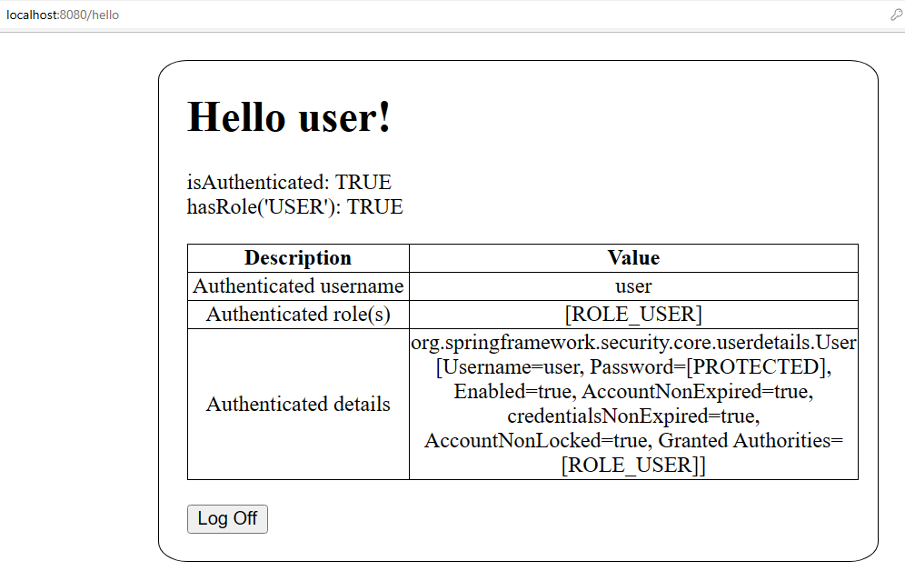

### Spring Boot Demo 4 Security Authentication Example (Login page with Password)

**Steps:**
<ol>
<li>To setup IDE for Spring project, follow steps in https://github.com/worldpeacez0991/SpringBoot_demo1</li>

 

<li>Start Spring Boot App
<ul>
<li>Via Spring IDE, open 'SecuringWebApplication.java', press 'Alt+Shift+X, B', to start 'Spring Boot App'</li>
<li>Via browser, type 'http://localhost:8080', to test</li>
<kbd></kbd> 
<kbd></kbd> 
<kbd></kbd> 
</ul>
</li>
</ol>

Credits: https://spring.io/team 
Source: https://spring.io/guides/gs/securing-web/ 
Source: https://www.baeldung.com/spring-security-thymeleaf 
Source: https://www.baeldung.com/spring-thymeleaf-user-info 
